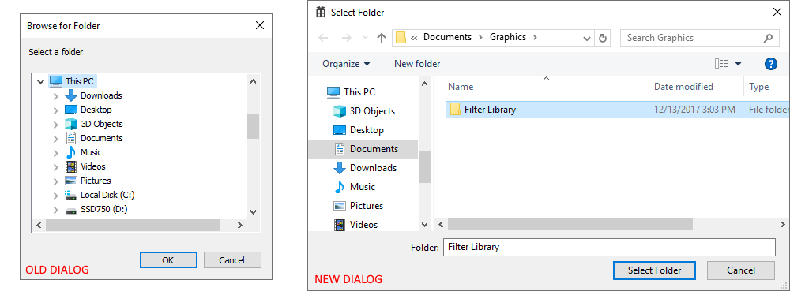

# Script: Replace SHBrowseForFolder with IFileDialog

Replace the legacy folder dialog with the new IFileDialog dialog, enabling path entry.



(Left) Legacy SHBrowseForFolder dialog, (Right) modern IFileDialog dialog.

## How to use this script

- Install Frida (`npm -g install frida frida-compile`)
- Open `Visual Studio` and build `SHBrowseForFolderExample.sln`
- Execute `compile.cmd` to merge the scripts
- Execute `run.cmd` to launch and attach Frida
- Select `File` -> `Open...` to invoke the folder selection dialog.

### Manual steps

- Launch SHBrowseForFolderExample.exe
- Locate the `PROCESSID` in task manager
- Attach Frida manually: `frida -p PROCESSID -l Fix-SHBrowseForFolder.compiled.js`

## Runtime output

Once Frida is attached, you will see `Ready` in the log.

Once `Open...` is clicked and a file selected, these entries will be in the log:

```
SHBrowseForFolder Entry
Flags: 0x0
SHBrowseForFolder Exit 0x3f1f898
```
