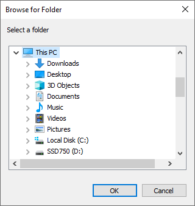
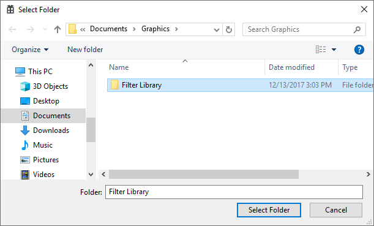

# Frida scripts for Windows application hooking
This repository contains scripts for working with Frida on Windows.  The objective of Frida scripts is to inject into a third-party target process and modify behavior.

## Replace calls to SHBrowseForFolder with IFileDialog
Replace the legacy folder dialog with the new dialog, enabling path entry.



Legacy SHBrowseForFolder folder selection dialog 



Modern IFileDialog folder selection dialog

### [View and install Fix-SHBrowseForFolder script](./Fix-SHBrowseForFolder/README.md)

## Assign a unique taskbar identity
Group a specific window differently on the taskbar:


### [View and install Fix-TaskbarIdentity script](./Fix-TaskbarIdentity/README.md)

## Common scripts

### [See README for all common scripts](./common/README.md)

### DotNet.js

Call .net APIs directly from javascript.

```js
System.IO.File.WriteAllText(path, "log data");
```

### Win32.js
Win32.js has features for working with `GUID`, `HSTRING`, `BSTR`, C-style structs as well as calling COM and WinRT APIs.

#### Examples

Initialize COM (CoInitialize)
```js
COM.Initialize(COM.ApartmentType.STA);
```

Allocate memory and fill in a GUID:
```js
var CLSID_FileOpenDialog = Win32.GUID.alloc("DC1C5A9C-E88A-4dde-A5A1-60F82A20AEF7");
```

Define a COM interface based on IUnknown:
```js
var IFileDialog = new COM.Interface(COM.IUnknown, {
	Show: [0, ['uint']],
	SetOptions: [6, ['uint']],
	GetResult: [17, ['pointer']],
}, "42f85136-db7e-439c-85f1-e4075d135fc8");
```
Each entry value is an ordinal in the interface and a set of function argument types.

Create an object and work with the resulting COM interfaces:
```js
var modalWindow = COM.CreateInstance(CLSID_FileOpenDialog, COM.ClassContext.InProc, IFileDialog);
modalWindow.SetOptions(FOS_PICKFOLDERS);
modalWindow.Show(browseinfo.hwndOwner);

var shellItem = new COM.Pointer(IShellItem);
COM.ThrowIfFailed(modalWindow.GetResult(shellItem.GetAddressOf()));

var pidl = Memory.alloc(Process.pointerSize);
COM.ThrowIfFailed(SHGetIDListFromObject(shellItem.Get(), pidl));
```

Create a struct around `browseinfoPtr` memory:
```js
var browseinfo = new Win32.Struct({ // BROWSEINFO
		'hwndOwner':'int',
		'pidlRoot':'pointer',
		'pszDisplayName':'pointer',
		'lpszTitle':'pointer',
		'ulFlags':'uint',
		'lpfn':'pointer',
		'lParam':'long',
		'iImage':'int',
	}, browseinfoPtr);
```

Then read or write as javascript object properties:
```js
console.log("Flags: 0x" + browseinfo.ulFlags.toString(16));
```